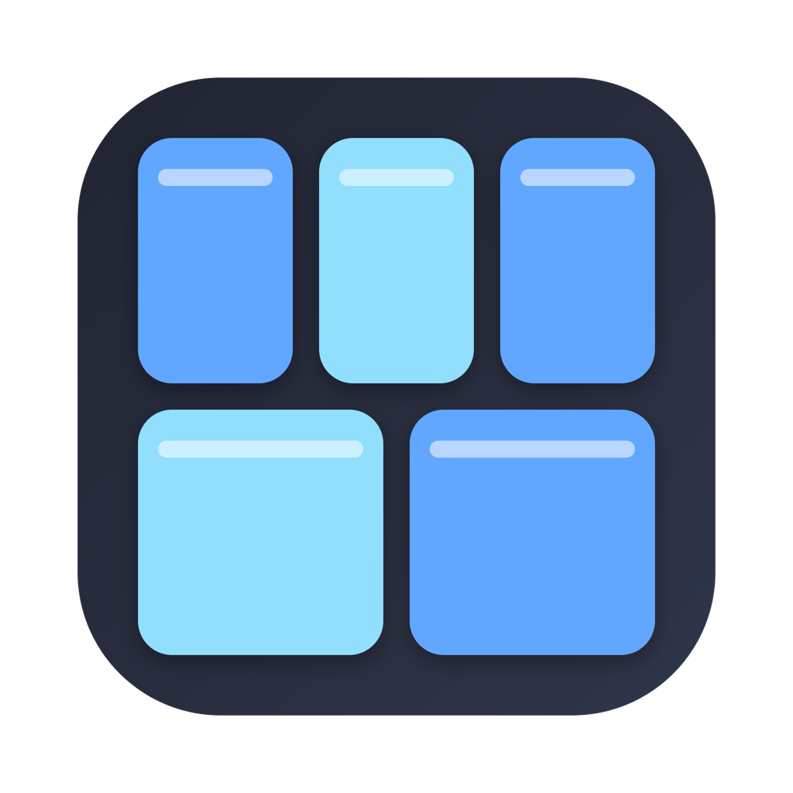
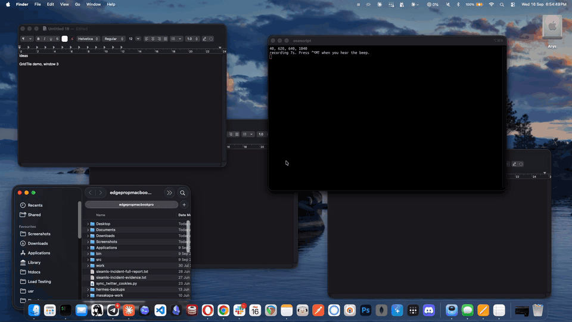

<p align="center">
  
</p>

<h1 align="center">GridTile</h1>

<p align="center">
  <b>One shortcut. Every window on screen snaps into a grid that fits.</b><br>
  No presets. No dragging to edges. No counting. Press <kbd>⌃</kbd><kbd>⌥</kbd><kbd>⌘</kbd><kbd>T</kbd> and you are done.
</p>

<p align="center">
  
  
  
  
</p>

<p align="center">
  
</p>

<p align="center"><sub>Six terminal windows, one keypress. Window contents blurred.</sub></p>

## Why this exists

macOS Sequoia added native window tiling. It stops at halves and quarters. Two windows, fine. Four, fine. Seven? You are back to dragging.

Rectangle, Magnet, Moom and friends solve this with *more presets*: thirds, sixths, custom grids, dozens of shortcuts to memorize. That is the wrong direction. I never want to think "is this a 3x2 moment or a 4x2 moment". I want the computer to count for me.

GridTile has exactly one action. It looks at how many windows are visible on the display under your cursor, picks the grid that fits them, and tiles. Open another window, press again, the grid re-flows. Close three, press again, it re-flows.

| Windows | 16:9 display | 16:10 MacBook |
|:-:|:-:|:-:|
| 1 | full screen | full screen |
| 2 | side by side | side by side |
| 3 | 3 columns | 3 columns |
| 4 | 2 x 2 | 2 x 2 |
| 5 | 3 on top, 2 below | 3 on top, 2 below |
| 7 | 4 on top, 3 below | 4 on top, 3 below |
| 9 | 5 + 4 | 5 + 4 |
| 12 | 4 x 3 | 4 x 3 |

The rule: try every column count, score each candidate by its worst cell (how far from square, including the stretched last row), keep the lowest. Cells stay as square as the display allows. A portrait display gets rows instead of columns. The last row stretches its windows to fill the width so there is never an empty hole.

## What counts as a window

Only what you can actually see on the display under the mouse:

- current Space only
- minimized windows are ignored
- hidden apps are ignored
- other displays are ignored (tile each one separately by moving the mouse there)
- Dock, menu bar, Control Center, Spotlight and other system chrome are skipped

Windows keep their rough position. GridTile sorts them top to bottom, left to right, then fills the grid in that order, so the window that was top-left stays top-left.

## Install

Requires macOS 13 Ventura or later and Xcode command line tools (`xcode-select --install`).

```bash
git clone https://github.com/aryswisnu/gridtile.git
cd gridtile
./build.sh
open /Applications/GridTile.app
```

macOS will ask for Accessibility permission. Grant it in **System Settings > Privacy & Security > Accessibility**, then quit and relaunch GridTile.

A `⊞` icon appears in the menu bar with three items: **Tile Now**, **Launch at Login**, **Quit**.

> **Rebuilding?** The app is ad-hoc signed by default, so every build has a new code hash and macOS silently stops trusting it, even though the toggle still shows "on". After each `./build.sh`: remove GridTile from the Accessibility list with the minus button, relaunch, and grant again.
>
> To make the grant stick across builds, create a self-signed certificate once (Keychain Access > Certificate Assistant > Create a Certificate, name `GridTile Dev`, type **Code Signing**) and build with:
>
> ```bash
> CODESIGN_IDENTITY="GridTile Dev" ./build.sh
> ```

## How it works

Around 250 lines of Swift, no dependencies.

1. **Find windows.** `CGWindowListCopyWindowInfo` with `optionOnScreenOnly` returns exactly what is drawn on screen right now. Filter to layer 0 (normal windows), skip tiny ones, skip system owners, keep the ones whose center is on the target display.
2. **Compute the grid.** `gridLayout(count:in:)` is a pure function over a `CGRect`. It is the only part with unit tests, because it is the only part that can be tested without a window server.
3. **Move windows.** Each CG window is matched to its Accessibility element by PID and frame, then resized with `AXUIElementSetAttributeValue`. Size is set before and after position, because several apps overshoot height by a pixel otherwise.
4. **Hotkey.** Carbon's `RegisterEventHotKey`. Old API, still the only public one that works from a background app without Input Monitoring permission.

```
Sources/GridTileCore/Grid.swift     pure layout math, tested
Sources/GridTile/Windows.swift      CGWindowList + AX matching + apply
Sources/GridTile/Hotkey.swift       Carbon global hotkey
Sources/GridTile/main.swift         status item, menu, wiring
```

## Compared to

| | GridTile | macOS native | Rectangle | Magnet | Moom |
|---|:-:|:-:|:-:|:-:|:-:|
| Auto grid from window count | **yes** | no | no | no | no |
| Shortcuts to learn | **1** | 8+ | 20+ | 15+ | custom |
| Max grid | any | 2x2 | 3x2 | 3x2 | custom |
| Price | free | free | free | $5 | $10 |
| Dependencies | 0 | | | | |

GridTile does not replace those tools. It does one thing they all skip.

## Test

```bash
swift test
```

Covers the layout math for 0, 1, 2, 4, 7, 12 and non-overlap for 1 through 16.

## Roadmap

Deliberately small. Things that might land if people ask:

- configurable gap between windows
- configurable hotkey
- tile all displays in one press
- exclude specific apps

Not planned: presets, drag-to-edge snapping, saved layouts. Other tools do those well.

## Contributing

Open an issue with your window count, display setup and what you expected. PRs welcome, keep the zero-dependency rule.

## License

MIT
